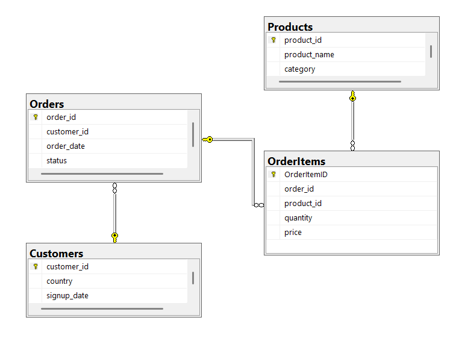
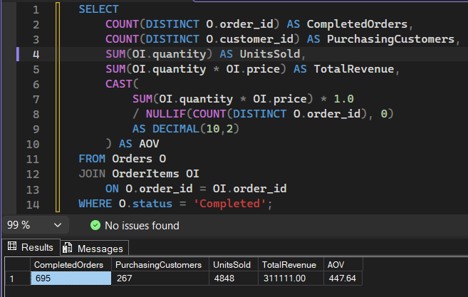
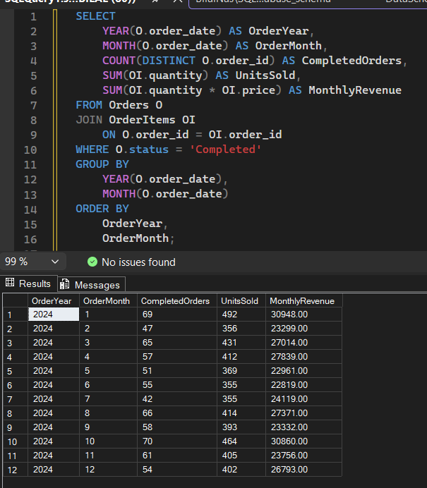
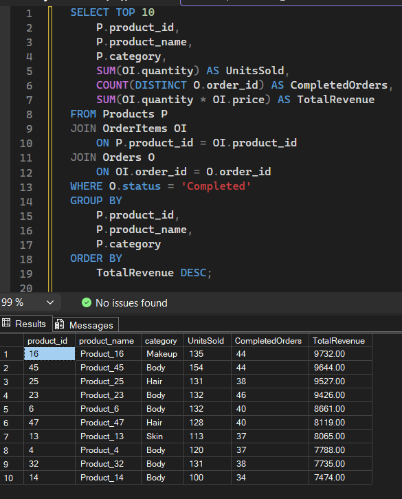
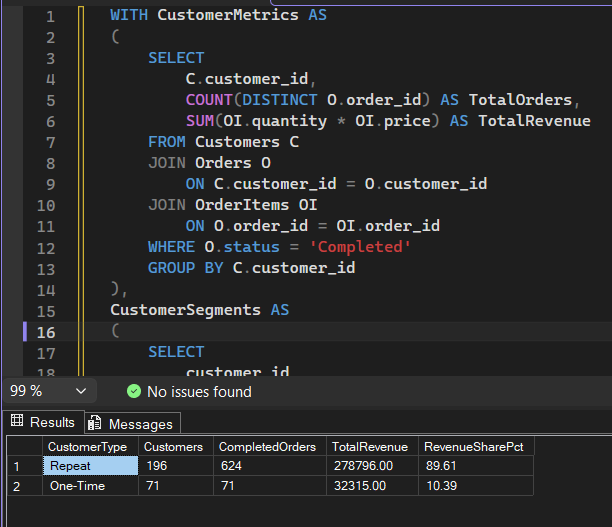
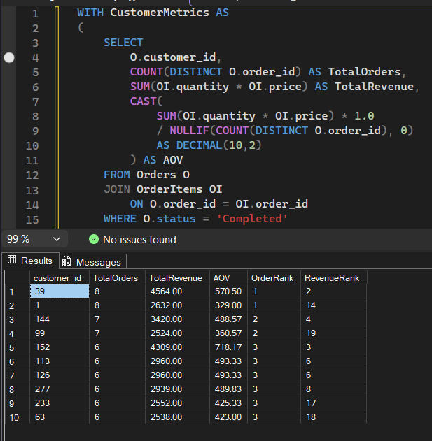
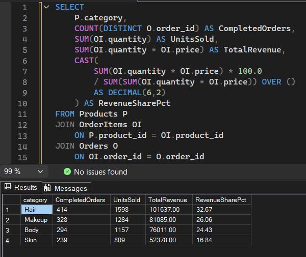

# E-Commerce Sales Analysis using SQL

## Project Overview

This project analyzes a relational e-commerce sales dataset using **Microsoft SQL Server (T-SQL)** to explore sales performance, customer purchasing behavior, product performance, revenue trends, and key business KPIs.

The project covers the complete SQL analysis workflow, including database schema creation, CSV data import, data validation, exploratory analysis, joins, aggregations, CTEs, subqueries, conditional logic, and window functions.

The repository also includes both my **SQL learning process** and a **final polished analysis**, showing the progression from exploratory query development to structured business analysis.

---

## Business Objectives

The analysis was designed to answer questions such as:

- What are the overall sales KPIs?
- How does revenue change across the year?
- Which products and categories generate the most revenue?
- How do one-time and repeat customers contribute to revenue?
- Do customers who place more orders necessarily generate more revenue?
- How do order frequency and Average Order Value (AOV) affect customer value?
- Which customer and product segments contribute most to business performance?

---

## Dataset

The project uses four related CSV datasets:

| Table | Description |
|---|---|
| `Customers` | Customer ID, country, and signup date |
| `Orders` | Order ID, customer ID, order date, and order status |
| `OrderItems` | Products, quantities, and prices associated with each order |
| `Products` | Product ID, product name, and category |

### Dataset Size

- **300 customers**
- **1,000 orders**
- **2,000 order-item records**
- **50 products**
- Order period: **January 1, 2024 – December 30, 2024**

---

## Database Schema

The data was structured as a relational SQL Server database with primary and foreign key relationships between customers, orders, order items, and products.



### Relationships

- One customer can place multiple orders.
- One order can contain multiple order-item records.
- One product can appear in multiple order-item records.
- `OrderItemID` is used as a surrogate primary key for `OrderItems`.

A staging table was used when importing order-item data because the source CSV did not contain the SQL Server-generated `OrderItemID`.

---

## Tools & SQL Techniques

**Database**
- Microsoft SQL Server
- SQL Server Management Studio (SSMS)

**SQL techniques demonstrated**
- SELECT statements
- Filtering and sorting
- INNER JOIN and LEFT JOIN
- GROUP BY and aggregate functions
- `COUNT(DISTINCT)`
- CASE expressions
- Subqueries
- Common Table Expressions (CTEs)
- Conditional aggregation
- Window functions
- `ROW_NUMBER()` / `DENSE_RANK()`
- Date-based analysis
- Average Order Value (AOV)
- Customer segmentation
- Revenue contribution analysis
- Data validation and NULL checks
- Primary and foreign keys
- Staging-table data import

---

# Analysis & Key Findings

## 1. Executive Sales KPIs

The completed-order analysis produced the following overall KPIs:

- **695 completed orders**
- **267 purchasing customers**
- **4,848 units sold**
- **311,111 total revenue**
- **447.64 Average Order Value (AOV)**



These metrics provide a high-level view of completed sales activity and form the baseline for the deeper customer and product analyses.

---

## 2. Monthly Revenue Performance

Monthly sales were analyzed across 2024 using completed orders.



### Key Findings

- **January** generated the highest monthly revenue at **30,948**.
- **October** was a close second at **30,860**.
- October recorded the highest number of completed orders, with **70 orders**.
- **June** recorded the lowest monthly revenue at **22,819**.
- Monthly revenue fluctuated throughout the year rather than following a continuous upward or downward trend.

This shows that order volume alone does not completely explain monthly revenue performance.

---

## 3. Top Products by Revenue

Product-level analysis was performed by joining `Products`, `OrderItems`, and `Orders`.



### Key Findings

- **Product_16 (Makeup)** generated the highest revenue at **9,732**.
- Product_16 sold **135 units** across **44 completed orders**.
- **Product_45 (Body)** sold more units (**154**) but generated slightly lower revenue (**9,644**).
- This demonstrates that higher unit sales do not necessarily result in higher revenue because product prices and order composition also affect performance.

---

## 4. Customer Segmentation: One-Time vs Repeat

Customers were classified according to their number of completed orders.



### Results

| Customer Type | Customers | Completed Orders | Revenue | Revenue Share |
|---|---:|---:|---:|---:|
| Repeat | 196 | 624 | 278,796 | 89.61% |
| One-Time | 71 | 71 | 32,315 | 10.39% |

### Key Finding

**Repeat customers generated 89.61% of completed-order revenue**, making them the primary revenue-driving customer segment in this dataset.

This highlights the importance of customer retention and repeat purchasing behavior.

---

## 5. Order Frequency vs Customer Revenue

Customer-level metrics were calculated and ranked using CTEs and window functions to investigate whether customers who place more orders necessarily generate more revenue.



### Key Findings

Customer 39 and Customer 1 both placed **8 completed orders**, but:

- Customer 39 generated **4,564** in revenue with an AOV of **570.50**.
- Customer 1 generated **2,632** in revenue with an AOV of **329.00**.

Customer 152 placed only **6 orders** but generated **4,309** in revenue with an AOV of **718.17**.

### Business Insight

**Higher order frequency does not necessarily mean higher customer revenue.**

Average Order Value plays an important role in customer value, meaning customers with fewer but higher-value purchases can outperform customers who order more frequently.

---

## 6. Category Performance

Revenue contribution was also analyzed at product-category level.



### Results

| Category | Completed Orders | Units Sold | Revenue | Revenue Share |
|---|---:|---:|---:|---:|
| Hair | 414 | 1,598 | 101,637 | 32.67% |
| Makeup | 328 | 1,284 | 81,085 | 26.06% |
| Body | 294 | 1,157 | 76,011 | 24.43% |
| Skin | 239 | 809 | 52,378 | 16.84% |

### Key Finding

**Hair was the strongest-performing category**, generating **101,637** in revenue and accounting for **32.67% of completed-order revenue**.

Hair also recorded the highest number of units sold among the four categories.

> Note: Completed-order counts across categories are not additive because a single order can contain products from multiple categories.

---

# Business Insights

The analysis highlights several important patterns:

1. **Repeat customers are the main revenue drivers**, contributing nearly 90% of completed-order revenue.
2. **Order frequency alone is not enough to determine customer value**; AOV significantly affects total customer revenue.
3. **Hair is the leading product category**, contributing approximately one-third of completed-order revenue.
4. **High sales volume does not always translate directly into the highest revenue**, as demonstrated by differences between top-performing products.
5. Revenue varied throughout 2024 without a consistent upward or downward monthly trend.

These findings demonstrate how SQL can be used not only to retrieve data, but also to investigate business questions and translate transactional data into actionable insights.

---

## Repository Structure

```text
ecommerce-sales-sql-analysis/
│
├── data/
│   ├── customers.csv
│   ├── order_items.csv
│   ├── orders.csv
│   └── products.csv
│
├── screenshots/
│   ├── database_schema.png
│   ├── 01_executive_kpis.png
│   ├── 02_monthly_revenue_trend.png
│   ├── 03_top_products_by_revenue.png
│   ├── 04_customer_segmentation.png
│   ├── 05_customer_order_vs_revenue_rank.png
│   └── 06_category_performance.png
│
├── sql/
│   ├── 00_Database_Setup_and_Import.sql
│   ├── 01_SQL_Learning_Process.sql
│   └── 02_SQL_Final_Analysis.sql
│
└── README.md
```

---

## SQL Files

### `00_Database_Setup_and_Import.sql`

Creates the relational database structure, defines primary and foreign keys, imports the source CSV files, validates foreign-key values, and loads order-item data through a staging table.

### `01_SQL_Learning_Process.sql`

Documents my SQL learning and analysis process, including exploratory queries, alternative approaches, corrections, and progression toward more advanced SQL techniques.

### `02_SQL_Final_Analysis.sql`

Contains the cleaned and structured final SQL analysis used to answer the project's business questions.

---

## What I Learned

This project strengthened my practical understanding of:

- Designing and working with relational database structures
- Importing and validating data in SQL Server
- Joining multiple related tables
- Translating business questions into SQL queries
- Using CTEs and subqueries to structure complex analysis
- Applying window functions for ranking and comparison
- Calculating business KPIs such as revenue and AOV
- Segmenting customers based on purchasing behavior
- Comparing order frequency, customer value, product performance, and revenue contribution
- Moving from exploratory SQL toward cleaner, reusable analytical queries

---

## Future Improvements

Potential extensions to this project include:

- Building a Power BI dashboard using the SQL analysis as a data source
- Adding cohort or customer retention analysis
- Creating customer value segments based on frequency and spending
- Expanding time-series analysis if multi-year data becomes available

---

## Author

**Muhammed Bilal**

B.Sc. (Hons) Computer Science – Data Analytics  
Aspiring Data Analyst / Business Intelligence Analyst
